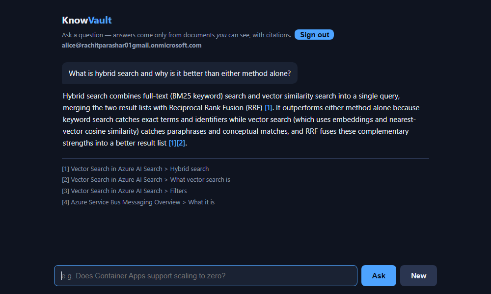
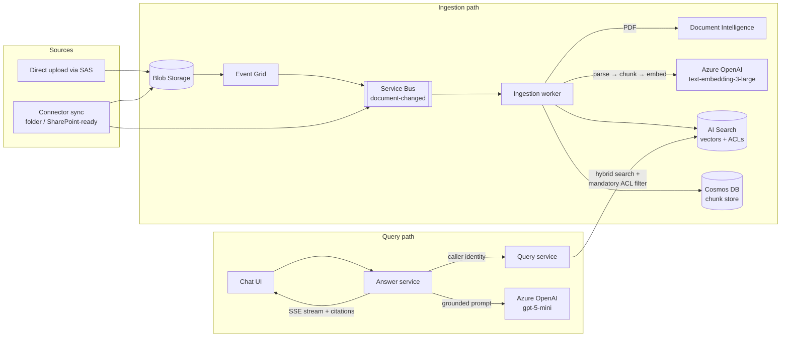

# KnowVault

[](https://github.com/Rachit-parashar/knowvault/actions/workflows/pr.yml)
[](https://github.com/Rachit-parashar/knowvault/actions/workflows/main.yml)


**A multi-tenant, permission-aware RAG platform on Azure.** Organizations connect document sources; content is chunked, embedded, and indexed with permission metadata; users ask questions in a chat UI and get **streamed, cited answers drawn only from documents they are allowed to see**.

Built with .NET 10 / Aspire, seven microservices, and eleven Azure services — deployed to Azure Container Apps with managed identity everywhere and **zero connection strings or keys in the entire system**.



## The demo that matters

Same tenant. Same question. Two users — one in the HR group, one not:

> **alice:** *What is the average merit increase in the HR compensation brief?*
> → `The average merit increase is 7.4% [1].`
>
> **mallory:** *What is the average merit increase in the HR compensation brief?*
> → `I don't have information on that.`

Mallory's refusal isn't the model being polite — the restricted chunks were **never search candidates** for her. The ACL filter runs inside the search query itself, so unauthorized content can't leak through ranking, prompt assembly, or logging. And when a question isn't answerable from the corpus at all (*"What is the capital of France?"*), the system refuses rather than falling back to the model's world knowledge.

## Success criteria — all verified

| # | Promise | Verified by |
|---|---------|-------------|
| 1 | **Tenant isolation** — Tenant A never retrieves Tenant B content | Eval security check, 100% on every run |
| 2 | **Security trimming** — no access to doc X ⇒ no content from X, even if X is the best match | Live alice/mallory demo + planted-secret eval, 100% |
| 3 | **Citations** — every claim links to its exact source chunk | Every answer; judge-scored citation accuracy 100% |
| 4 | **Quality gates** — golden-question suite catches regressions | 11-question suite re-run after every significant change |
| 5 | **Cost visibility** — tokens and cost per query, per tenant | `knowvault.tokens.*` / `knowvault.cost.usd` metrics + usage ledger |
| 6 | **Reproducibility** — entire environment from one command | `scripts/deploy-dev.ps1` / `teardown-dev.ps1`, exercised repeatedly |

**Latest eval run** (see [evals/results](evals/results/)): hit-rate@10 **100%**, MRR **1.0**, refusal correctness **100%**, groundedness **100%**, citation accuracy **100%**, security **100%**, latency p50 ≈ 4s / p95 ≈ 8.5s.

## Architecture



Seven services in one solution ([ADR-003](docs/adr/ADR-003-monorepo.md) — a monorepo of microservices, not a monolith):

| Service | Responsibility | Status |
|---|---|---|
| `Admin` | Upload SAS issuance, per-document ACLs, tenant management | Deployed |
| `Connector` | Interval sync: hash-based change detection, ACL capture, deletion tombstones. Local-folder connector live; SharePoint is an adapter over the same interface | Deployed |
| `Ingestion` | Queue worker: extract (PDF via Document Intelligence) → chunk → embed → index; delete processor; durable idempotency; poison messages to DLQ | Deployed |
| `Query` | Hybrid BM25 + vector retrieval (RRF) with the mandatory security-trimming filter | Deployed |
| `Answer` | Grounded prompt, SSE token streaming, `[n]` citations, refusal contract, usage metrics; serves the chat UI | Deployed (public) |
| `Eval` | Golden-question harness: seeding through the real pipeline, LLM judge, security checks, reports | Local (needs repo fixtures) |
| `Gateway` | YARP BFF / APIM front — placeholder | Skeleton |

## The security model (the interesting part)

ACLs are **denormalized into the index at sync time** and enforced by a mandatory filter at query time ([ADR-002](docs/adr/ADR-002-acl-strategy.md)). The filter is built in exactly one place — [`SecurityTrimming.BuildFilter`](src/Shared/KnowVault.Domain/Security/SecurityTrimming.cs) — from the caller's verified identity, never from request bodies:

```
tenantId eq '{tid}' and allowedPrincipals/any(p: search.in(p, 'user:{oid}|group:{g1}|tenant:{tid}:all', '|'))
```

Identity segments are validated against a safe alphabet (OData-injection and separator-collision attempts are rejected — there are unit tests that attack it). Group membership resolves **server-side**; a caller can present a user but can never grant themselves groups. Trade-off, documented: permission changes propagate at sync latency, mitigated by short sync intervals and deletion tombstones.

## Evaluation harness

Ten fixture documents (public Azure docs content, so the repo is shareable) plus **two planted restricted documents** — one in a foreign tenant, one restricted to a single user. Every run measures retrieval hit-rate@10, MRR, LLM-judged groundedness and citation accuracy, refusal correctness, two-sided security checks (unauthorized must refuse *and* authorized must answer), and latency. Seeding goes through the real pipeline — no shortcuts. Reports land in [evals/results](evals/results/) as markdown + JSON.

## Running it

**Locally** (needs .NET 10 SDK + Docker Desktop for the Azurite/Service Bus emulators):

```bash
dotnet run --project src/KnowVault.AppHost   # Aspire dashboard, all services, traces
dotnet test                                   # 47 unit tests
```

**Azure** (needs an Azure subscription + `az login`):

```powershell
.\scripts\deploy-dev.ps1 -SqlAdminPassword <pw>   # ~10 min: 16 resources + 5 container apps
.\scripts\teardown-dev.ps1                        # removes everything, incl. soft-delete purges
```

Container images publish straight from the SDK — no Dockerfiles:

```bash
dotnet publish src/Services/KnowVault.Query -c Release /t:PublishContainer \
  -p:ContainerRegistry=<acr>.azurecr.io -p:ContainerRepository=knowvault/query
```

## Cost

Designed to run on a free-trial subscription: AI Search free tier, serverless SQL/Cosmos, scale-to-zero apps, pay-per-token OpenAI. Idle cost ≈ **$15/month** (container registry + one warm ingestion replica); a generated answer costs ≈ **$0.0003**. Tokens and cost are first-class metrics, tagged per tenant.

## Observability

Every service ships OpenTelemetry: the Aspire dashboard locally, Application Insights in Azure (traces, dependencies, custom `knowvault.*` metrics). One distributed trace follows a question from the chat UI through Query, AI Search, and gpt-5-mini token streaming.

## Production lessons (learned live, encoded in the repo)

- **Models retire under you** — the originally-planned gpt-4o-mini was retired mid-project; all model names/versions are now pinned Bicep parameters ([ADR-004](docs/adr/ADR-004-model-selection.md)).
- **Popular regions reject new subscriptions** — eastus2 refused SQL/Search provisioning; region is a parameter, capacity checked programmatically.
- **Soft-deleted resources block redeploys** — deleted OpenAI accounts and Key Vaults reserve their names for days; the teardown script purges them.
- **RBAC propagation races container provisioning** — an app whose first image pull beat the `AcrPull` grant stays `Failed` on identical re-deploys; the fix (delete, then redeploy) was bisected with probe apps.
- **Silent-failure watchers are worthless** — every automated check here watches for failure signatures, not just success.

## What I'd change at 10× scale

Index-per-tenant sharding (today: one index, filter-partitioned), AKS migration (services are plain containers; [ADR-001](docs/adr/ADR-001-compute-choice.md) documents the path), ACL indirection via permission-set IDs to cut write amplification, provisioned OpenAI throughput, KEDA queue-depth scaling for ingestion, semantic caching scoped per tenant + permission-set hash, and private endpoints + APIM in front.

## Roadmap

Remaining for v1 polish: real Entra ID sign-in (dev test-user directory today), CI eval gates via GitHub↔Azure OIDC, SharePoint connector (interface ready, needs an M365 tenant), semantic cache, golden set expansion to 40+ questions, k6 load test. Deliberately out of scope: fine-tuning, GraphRAG, agentic multi-hop retrieval, mobile clients.

## Docs

- [Architecture Decision Records](docs/adr/) — compute, ACL strategy, monorepo, model pinning
- [Knowledge transfer / operations runbook](docs/KNOWLEDGE-TRANSFER.md) — access inventory, deploy loop, 13 hard-won gotchas
- [Project documentation](docs/KnowVault-Project-Documentation.docx) — full plain-language walkthrough
- [Original build plan](docs/build-plan.md) · [Contributing](CONTRIBUTING.md) · [Security policy](SECURITY.md)
